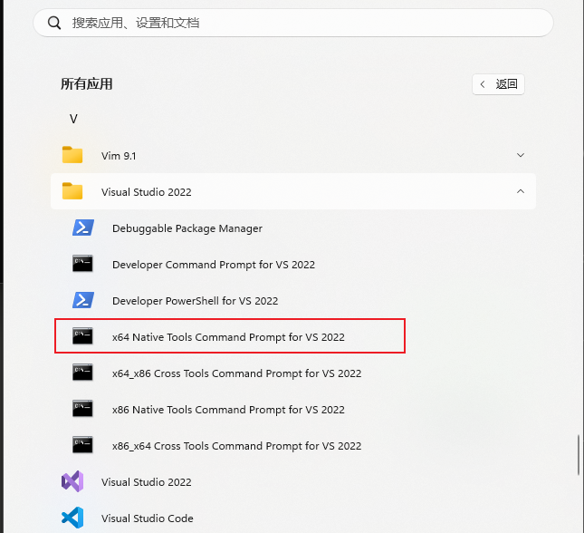

### **步骤 2：下载 gRPC 源码**

1. 打开 Windows 命令提示符（**Win + R**，输入 `cmd`，回车）。

2. 输入以下命令下载 gRPC 源代码：

   ```
   \\cmd
   git clone --recurse-submodules -b v1.57.0 https://github.com/grpc/grpc
   ```

   这会将 gRPC 源代码克隆到你的当前目录下一个名为 ==grpc==的文件夹。

   

### **步骤 3：构建 gRPC 和 Protobuf**

1. **进入 gRPC 目录**

   ```
   cmd
   cd grpc
   ```