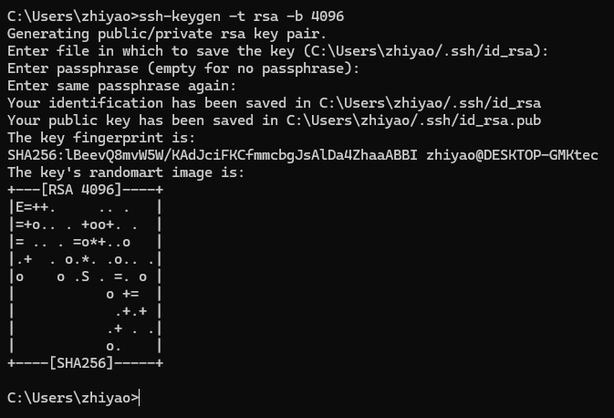

### g++ 重要编译参数

1. **-g**  编译带调试信息的可执行文件

```
# -g 选项告诉 GCC 产生能被 GNU 调试器GDB使用的调试信息，以调试程序。
# 产生带调试信息的可执行文件test1
g++ -g test1.cpp -o test
```

2. **-O[n]** 优化源码

```
## 所谓优化，例如省略掉代码中从未使用过的变量、直接将常量表达式用结果值代替等等，这些操作会缩减目标文件所包含的代码量，提高最终生成的可执行文件的运行效率。
# -0!选项告诉 g++ 对源代码进行基本优化。这些优化在人多数情况下都会使程序执行的更快。-02 选项告诉g++ 产生尽可能小和尽可能快的代码。如-O2，-O3，-On(n 常为0-3)
# -O!同时减小代码的长度和执行时间，其效果等价于-O1
# -O0 表示不做优化
# -O1 为默认优化
# -O2 除了完成-01的优化之外，还进行一些额外的调整工作，如指令调整等
# -O3 则包括循环展开和其他一些与处理特性相关的优化工作。
#选项将使编译的速度比使用-O时慢，但通常产生的代码执行速度会更快。
#使用 -O2优化源代码，并输出可执行文件
g++ -O2 test1.cpp
```

 

- 进入远程时不用每次输入密码的操作

  > 输入： ssh-keygen -t rsa -b 4096



## 2.4 静态库和动态库

**静态库**

1. 制作静态库

   ```
   g++ -c -o lib<库名>.a <源代码文件清单>
   ```

2. 使用静态库

   ```
   g++ <选项> <源代码文件名清单> -l<库名> -L<库文件所在的目录名>
   ```

3. 静态库的概念

​	程序编译时会把库文件的二进制代码链接到目标程序中，这种方式称为静态链接。

​	如果多个程序中用到了同一静态库中的函数，就会存在多份拷贝。

4. 静态库的特点
   - 静态库的链接是在编译时期完成的，执行的时候代码加载速度快。
   - 目标程序的可执行文件比较大，浪费空间。
   - 程序的更新和发布不方便，如果某一个静态库更新了，所有使用它的程序都需要重新编译。

**动态库**

	1. 制作动态库

```
g++ -fPIC -shared -o lib<库名>.so <源代码文件清单>
```

2. 使用动态库

   ```
   g++ <选项> <源代码文件名清单> -l<库名> -L<库文件所在的目录名>
   ```

3. 动态库的特点
   - 程序在运行的过程中，需要用到动态库时才把动态库的二进制代码载入内存
   - 可以实现进程之间的代码共享，因此动态库也称为共享库。
   - 程序升级比较简单，不需要重新编译程序，只需要更新动态库就行。

**优先使用动态库**

​	如果动态库和静态库同时存在，编译器将优先使用动态库。

## 2. 5 编译规则文件makefile

- Makefile 是一种用于自动化构建软件的脚本文件。它主要用于管理软件项目中的编译、链接和其他构建任务，通过定义一系列的规则和依赖关系，让编译器（如 GCC 等）和其他工具知道如何根据源文件生成目标文件和可执行程序。
- 简单来说，当你有一个包含多个源文件、头文件和可能的库文件的项目时，Makefile 可以帮助你更高效地组织编译过程，而不是手动逐个地编译每个源文件。

1. **基本结构和规则**

   - **规则格式**：一个典型的 Makefile 规则如下：

     ```
          target: dependencies
              commands
     ```

   - 其中，`target`是目标文件或可执行程序，它是规则的最终产物。例如，一个可执行文件`my_program`或者一个目标文件`my_object.o`。

   - `dependencies`是目标所依赖的文件列表。这些文件可以是源文件、头文件或者其他目标文件。例如，一个`.cpp`源文件和它所依赖的`.h`头文件。

   - `commands`是为了生成目标文件而需要执行的一系列命令。这些命令通常是编译器（如`g++`）或其他构建工具的命令，并且每个命令必须以一个制表符（`\t`）开头，这是 Makefile 语法的要求。

   - **示例规则**：假设我们有一个简单的 C++ 项目，包含一个源文件`main.cpp`，我们想要生成一个可执行文件`my_app`。Makefile 可以这样写：

     ```
          my_app: main.cpp
              g++ -o my_app main.cpp
     ```

   - 在这里，`my_app`是目标，`main.cpp`是依赖。`g++ -o my_app main.cpp`是命令，它告诉系统使用`g++`编译器将`main.cpp`编译并链接成一个名为`my_app`的可执行文件。


## 2.6 main函数的参数

1. `main`函数的标准参数形式

   - 在 C 和 C++ 语言中，

     ```
     main
     ```

     函数可以有两种标准的参数形式：

     - `int main(void)`：这种形式表示`main`函数没有参数。当程序不需要从命令行获取任何输入时，可以使用这种形式。例如，一个简单的程序只是在屏幕上输出固定的信息，如：

​		

