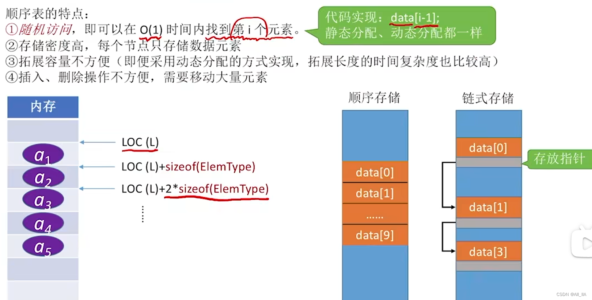
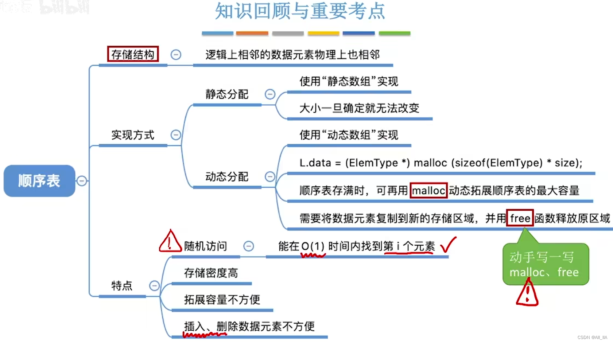

最常用的数据结构预算法:

- 数据结构：数组、链表、栈、队列、散列表、二叉树、堆、跳表、图、Tire树
- 算法： 递归、排序、二分查找、搜索、哈希算法、贪心算法、分治算法、回溯算法、动态规划、字符串匹配算法

# 线性表

|            |                            顺序表                            |                             链表                             |
| :--------: | :----------------------------------------------------------: | :----------------------------------------------------------: |
|  存储空间  |              预先分配，可能会导致空间闲置或溢出              |              动态分配，不会出现空间闲置或者溢出              |
|  存取元素  |           随机存取，按位置访问元素的时间复杂度O(1)           |         顺序存取，访问某位置的元素的时间复杂度为O(n)         |
| 插入、删除 | 插入和删除都要移动大量的元素。平均移动元素约为表的一半。时间复杂度O(n) | 不需要移动元素，只需要改变指针位置，继而改变结点之间的链接关系。时间复杂度O(1) |
|  适用情况  | 1.表长变化不大，或者事先就能确定变化的范围 2.很少进行插入和删除，需要下标访问元素 |             1.长度变化较大   2.频繁的插入和删除              |
|            |                 *这不就是vector的使用特点吗*                 |                  *这不就是list的使用特点吗*                  |

## ==顺序表==  

### 线性表的定义

- 每个数据元素所占空间一样大
- 线性表是具有==相同==数据类型的 $n(n>=0)$ 个数据元素的有限序列。
- 把顺序存储的方式实现线性表顺序存储。

### 顺序线性表的实现---------静态分配

- 当我们声明一个顺序表的时候，把length值置为0是很有必要的： **L.length = 0;**

#### 顺序表的定义

```cpp
#define MaxSize 10                        //定义最大长度
typedef struct{                           
	ElemType data[MaxSize];              //用静态的“数组”存放数据元素
	int length;                          //顺序表的当前长度
}SqList;                                 //顺序表的类型定义（静态分配方式）
```

#### 顺序表的初始化

```
bool InitList(SqList &L)
{
    L.elem = new ElemType[MAXSIZE]; //在堆区开辟内存
    if(!L.elem)
    {
        cerr<<"error"<<endl;
        return false;
    }
    L.length = 0;//设定线性表长度为0
    return 1;
}
```

#### 顺序表的销毁

```cpp
void DestroyList(SqList &L)
{
    if(L.elem)
    {
        delete L.elem;
    }
}
```

#### 顺序表的清空

```cpp
void ClearList(SqList &L)
{
    L.length = 0;
}
```

#### 判断线性表是否为空

```cpp
bool IsEmpty(const SqList &L)
{
    return static_cast<bool>(L.length);
}
```

#### 线性表的取值

```cpp
bool GetElem(const SqList &L, const size_t i, ElemType &e)
{
    if(i<1 || i>MAXSIZE)
    {
        cerr<<"out of range"<<endl;
        return false;
    }
    e = L.elem[i-1];
    return true;
}
```

#### 线性表的查找

```cpp
int LocateList(const SqList &L, const ElemType &e)
{
    for(int i = 0; i < L.length; ++i)
    {
        if(L.elem[i] == e)
        {
            return i+1;	//查找成功，返回其查找元素的第一个下标值
        }
    }
    return 0;	//未能找到对应元素，返回0
    //算法时间复杂度：O(n)
}
```

线性表的插入

```cpp
bool InsertList(SqList &L, const ElemType &e, const int &i)
{
    //判断线性表长度是否小于最大长度MAXSIZE
    if(L.length == MaxSize)
    {
        cerr << "can not insert!" <<endl;
        return false;
    }
    if(i<0 || i>L.length)
    {
        cerr << "wrong insert position!" <<endl;
        return false;
    }
    if(L.length > 0)
    {
        //将位于插入位置之后的元素一次向后挪动一位
        for(int k = L.length-1; k >= i; --k)
        {
            L.elem[p + 1] = L.elem[p];
        }
    }
    L.elem[i] = e;	//插入元素
    L.length += 1;	//线性表长度+1
    return true;    
    //算法时间复杂度：O(n)
}

```

#### 线性表的删除

```cpp
bool EraseList(SqList &L, const int &i)
{
    //异常判断
    if(i<0 || i>L.length)
    {
        cerr << "wrong erase position!" << endl;
        return false;
    }
    if(L.length == 0)
    {
        cerr << "List has no length" << endl;
        return false;
    }
    //将位于删除位置之后的元素依次向前挪动一位
    for (int k = i + 1; k < L.length; ++k)
    {
        L.elem[k - 1] = L.elem[k];
    }
    //线性表长度-1
    L.length -= 1;
    return true;
    //算法时间复杂度：O(n)
}
```


```cpp
/*不初始化数据元素，内存不刷0*/
#include <stdio.h>
#define MaxSize 10		        //定义最大长度

/*线性表的定义*/
typedef struct
{
    ElemType data[MaxSize];		//用静态的“数组”存放数据元素
    int length;				   //顺序表的当前长度
}SqList;					  //顺序表的类型定义(静态分配方式)

/*初始化一个顺序表*/
bool InitList(SqList &L)
{
    L.elem = new ElemType[MaxSize];	//在堆区开辟内存
    if(!L.elem)
    {
        cerr << "error" <<endl;     //cerr是标准错误流，用于向标准错误输出错误信息，摆布程序员发现处理问题。
        return false; 
    }
    L.length = 0;				   //设定线性表长度为0
    return 1;
}

int main()
{
    SqList L;					  //声明一个顺序表
    InitList(L);				  //初始化顺序表
    //......
    return 0;
}
```

### 顺序表的实现---------动态分配

​	顺序表是一种线性表的存储结构，可以在连续的内存空间中存储元素。动态分配顺序表是指在需要时，根据实际情况动态增加或释放存储空间。

以下是实现动态分配顺序表的基本步骤：

1. **定义结构体或类**：首先，需要定义一个结构体或类来表示顺序表，可以包含如下成员：

   - 数据区域的指针，用于存储元素的数组。

   - 当前顺序表的大小（元素个数）。

   - 当前分配的存储空间大小。

   - 其他辅助变量或信息。

2. **创建动态顺序表**：在内存中分配一定大小的空间作为动态顺序表的初始存储空间，并初始化顺序表的各个成员。可以使用动态内存分配函数（如malloc）来分配空间。

3. **插入元素**：当需要插入新元素时，按照顺序表的逻辑顺序找到插入位置。如果当前存储空间不足以容纳新元素，则需要进行动态扩容，重新分配更大的存储空间，并将原有的元素复制到新的空间中。

4. **删除元素**：当需要删除元素时，将待删除元素后面的元素向前移动，填补删除位置，并更新顺序表的大小。如果删除元素后，剩余存储空间占比过低，可以考虑进行动态缩容，释放多余的存储空间。

5. **销毁顺序表**：当顺序表不再使用时，需要释放占用的内存空间，即使用动态内存释放函数（如free）释放动态顺序表的存储空间。

#### 顺序表的定义

```cpp
#define InitSize 10		//顺序表的初始长度
typedef struct
{
    ElemType *data;		//指示动态分配数组的指针
    int MaxSize;		//顺序表的最大容量
    int length;			//顺序表的当前长度
}SeqList;			    //顺序表的类型定义(动态分配方式)

//Key： 动态申请和释放内存空间   
//C---- malloc、free函数
		L.data = (Elem Type*) malloc(sizeof(ElemType), *InitSize);
//C++---new、delete关键字
```

- malloc函数申请的是一整片连续的存储空间，malloc 函数返回一个指针，需要强制转换型为你定义的数据元素类型指针。
- malloc函数的参数，指明要分配多大的连续内存空间。

```cpp
#include<stdlib.h>            //malloc、free函数的头文件
#define InitSize 10          //默认的最大长度
typedef struct{
	int *data;               //指示动态分配数组的指针		
	int MaxSize;             //顺序表的最大容量
	int length;              //顺序表的当前长度
}SeqList;

void InitList(SeqList &L){
	//用malloc函数申请一片连续的存储空间，如下图所示
	//调用malloc函数，申请一整片连续存储空间，其大小能存的下10个int类型数据。
	//malloc会返回一个指针类型，将其转换成和int *data;同类型的指针类型(int *)，然后将返回值赋值给data
	L.data = (int *)malloc(InitSize*sizeof(int));
	//malloc返回的是开辟的一整片存储空间的起始地址->data[0]
	L.length = 0;
	L.MaxSize = InitSize; //将顺序表最大容量设置为初始值
}

//增加动态数组的长度
void IncreaseSize(SeqList &L, int len){
	int *p = L.data;      //将顺序表data指针的值赋给指针p，即p指针和data指向同一个位置
	//调用malloc函数，申请的另一块内存空间能够存得下当前所有数据元素，再多存5个新的数据元素，
	//再乘以每个数据元素的大小
	L.data = (int *)malloc((L.MaxSize + len)*sizeof(int));
	for(int i = 0; i < L.length; i++)
	{
		L.data[i] = p[i];     //将数据复制到新区域（时间开销大）
	}
	L.MaxSize = L.MaxSize + len;  //顺序表最大长度增加len
	//free会将p指针所指向的一整片(原空间)释放掉，归还给系统，这样就实现了内存的扩展。  
	free(p);                //释放原来的内存空间
	//由于*p是局部变量，在该函数执行完后，*p所在内存空间会被系统自动释放
}

int main()
{
	SeqList L;           //声明一个顺序表，计算机会开辟一小块存储空间用来存储SeqList顺序表
	InitList(L);         //初始化顺序表
	//......往顺序表中插入几个元素.......
	IncreaseSize(L, 5);
	return 0;
}

//realloc函数也可以实现，但建议初学者使用malloc和free更能理解背后的过程。

```





## ==单链表==

### 单链表的特性

​	单链表的特点是每个节点只有一个指针，指向下一个节点，而最后一个节点的指针指向空(null)。这意味着可以从链表的头节点开始，逐个访问每个节点，直到到达链表的末尾。

- 链表(链式存储)
  - 单链表(两种实现)
    - 带头结点
    - 不带头结点
  - 双链表
  - 循环链表
  - 静态链表

单链表是一种常见的[数据结构](https://so.csdn.net/so/search?q=数据结构&spm=1001.2101.3001.7020)，用于存储元素的序列。它由一系列节点组成，每个节点包含一个数据元素和一个指向下一个节点的引用（指针）。单链表中的节点之间通过指针连接起来，形成一个线性结构。单链表是一种简单但灵活的数据结构，常用于实现队列、堆栈和图等其他高级数据结构。

|      | 顺序表(顺序存储)                 | 单链表(链式存储)                     |
| ---- | -------------------------------- | ------------------------------------ |
| 优点 | 可随机存取，存储密度高           | 不要求大片连续空间，改变容量方便     |
| 缺点 | 要求大片连续空间，改变容量不方便 | 不可随机存取，要耗费一定空间存放指针 |

一个单链表包含一个头节点和一些后续的节点。头节点是链表的起点，它不存储任何实际的数据，只是用来标识链表的开始。头节点的指针指向链表中的第一个实际节点，而每个节点的指针则指向下一个节点。

通过这种指针链接，可以在链表中插入、删除和查找元素。插入元素时，只需要修改相应节点的指针，将新的节点插入到链表中的合适位置。删除元素时，需要修改前一个节点的指针，使其指向删除节点的下一个节点，然后将删除节点的内存空间释放。查找元素时，可以从头节点开始沿着指针依次访问链表，直到找到目标元素或到达链表的末尾。

单链表在某些场景下的操作效率较高，例如插入和删除操作，因为只需要修改指针而不需移动大量元素。然而，单链表的缺点是访问特定位置的元素较慢，需要从头节点开始遍历整个链表。此外，单链表不支持直接反向遍历，因为只有每个节点的下一个节点的指针，没有指向前一个节点的指针。

#### 定义单链表

```cpp
struct LNode{			 //定义单链表结点类型
    ElemType data;		 //每个结点存放下一个数据元素
    struct LNode *next;	 //指针指向下一个结点
}
//增加一个新的结点：在内存中申请一个结点所需空间，并用指针p指向这个结点
struct LNode *p = (struct LNode*) malloc(sizeof(struct LNode));

typedef 关键字 ---数据类型重命名
typedef struct LNode LNode;     //将struct LNode 重命名为 LNode
LNode *p = (LNode*) malloc(sizeof(LNode)); //增加一个该类型的新结点
```

```cpp
/*写法一(推荐)*/
typedef struct LNode{		//定义单链表结点类型
    ElemType data;			//每个结点存放下一个数据元素
    struct LNode *next;		 //指针指向下一个结点
}LNode, *LinkList;

/*写法二*/
struct LNode{			 //定义单链表结点类型
    ElemType data;		 //每个结点存放下一个数据元素
    struct LNode *next;	 //指针指向下一个结点
}
/*要表示一个单链表时，只需声明一个头指针L,指向单链表的第一个结点
LNode *L;		//声明一个指向单链表第一个结点的指针(强调结点) 或
LinkList L;		//声明一个指向单链表第一个结点的指针(可读性更强，强调单链表)
*/
```

#### 不带头结点的单链

```cpp
/*定义一个单链表*/
typedef struct LNode{		//定义单链表结点类型
    ElemType data;			//每个结点存放下一个数据元素
    struct LNode *next;		 //指针指向下一个结点
}LNode, *LinkList;

/*初始化一个空的单链表*/
bool InitList(LinkList &L)
{
    L = NULL;		//空表，暂时还没有任何结点(防止脏数据污染)
    return true;
}
/*判断单链表是否为空*/
bool Empty(LinkList L)
{
	return (L==NULL);
}
```

#### 带头结点的单链表

```cpp
/*定义一个单链表*/
typedef struct LNode{		//定义单链表结点类型
    ElemType data;			//每个结点存放下一个数据元素
    struct LNode *next;		 //指针指向下一个结点
}LNode, *LinkList;

/*初始化一个单链表(带头结点)*/
bool InitList(LinkList &L)
{
    L = (LNode *) malloc(sizeof(LNode));	//分配一个头结点
    if(L==NULL)		
        return false;		//内存不足，分配失败
    L->next = NULL;
    return true;
}

```

