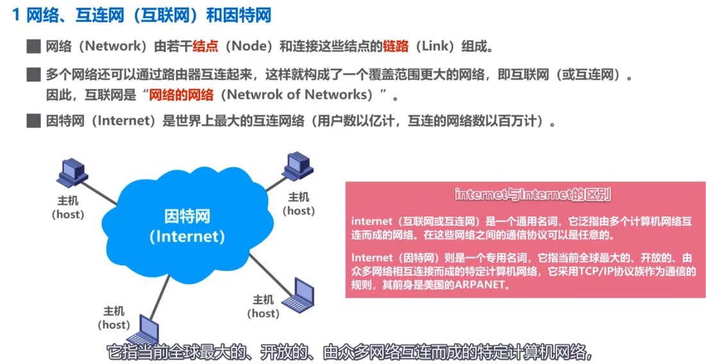
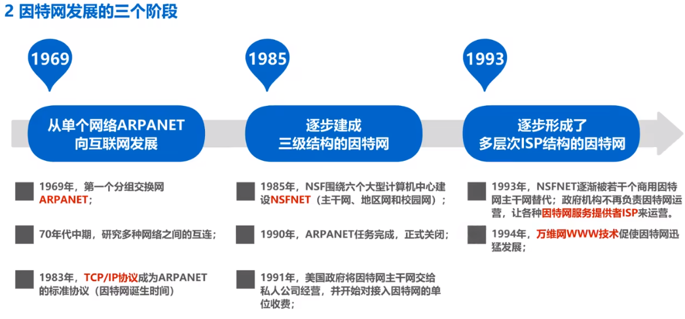
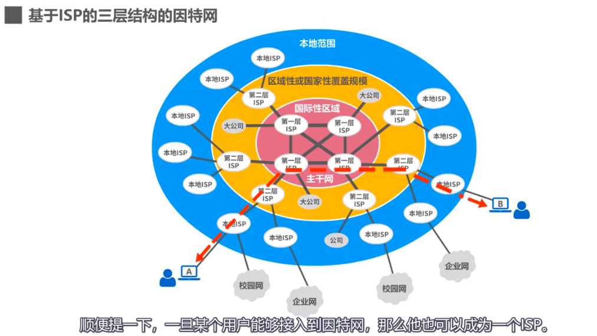
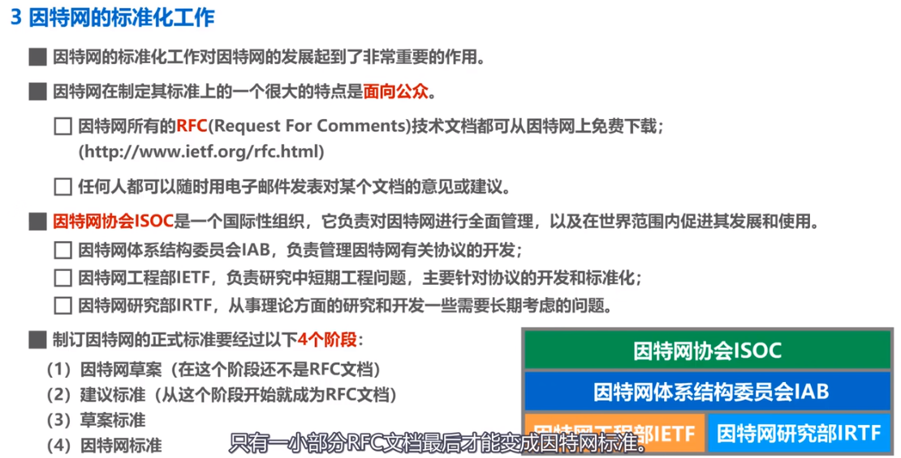
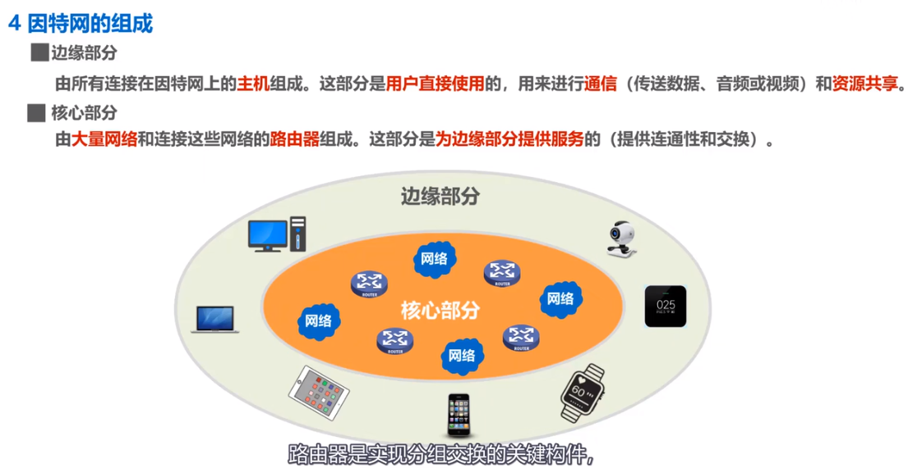
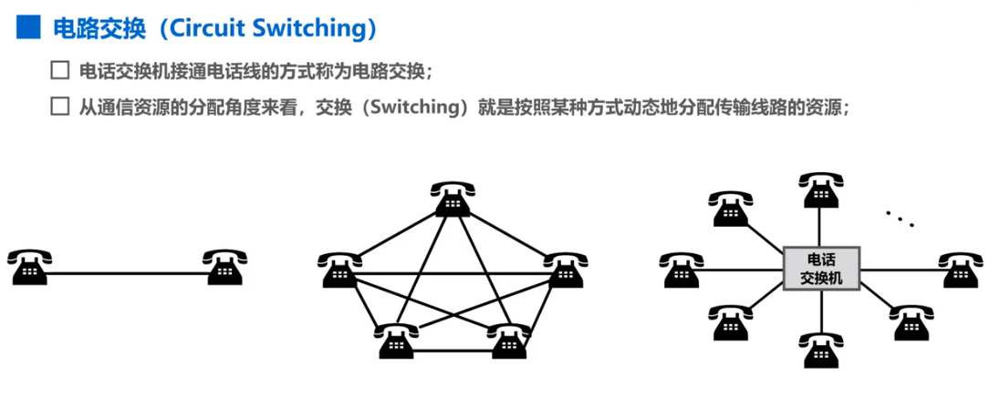
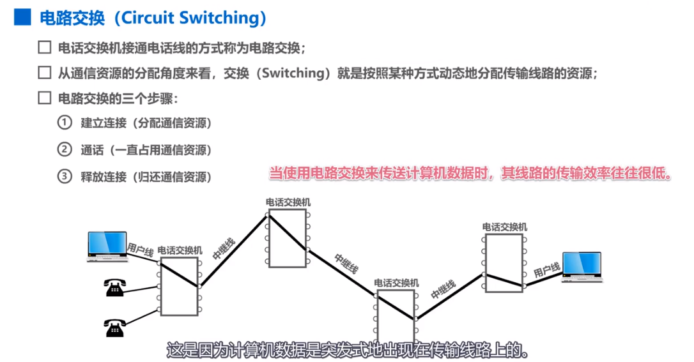
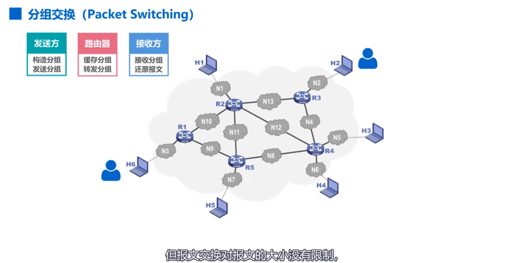
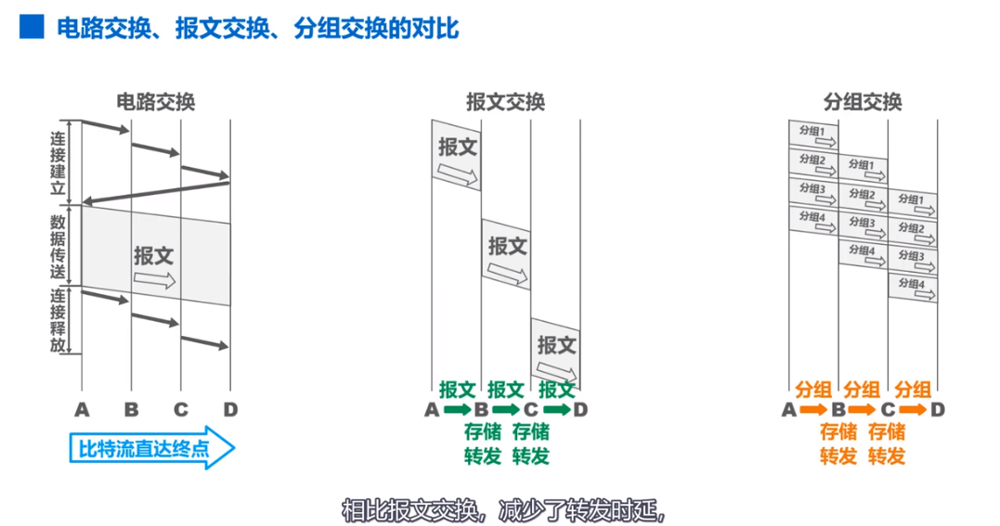
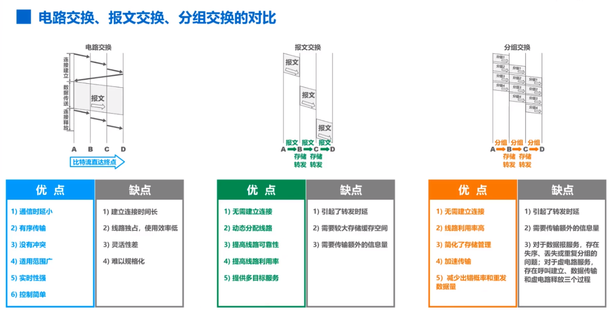

## 1. 因特网概述

分组传输可能出现乱序情况，即分组到达目的站的顺序可能与发送顺序不同。虽然视频没有详细演示分组丢失或重复的问题，但这些内容将在后续课程中讲解。分组交换过程中，发送方的任务是构造和发送分组，而接收方则负责接收和还原报文。这一过程确保了数据在网络中准确传递，不会因路径不同而丢失。

**电路交换**的基本原理是通过电话交换机动态分配通信资源。其过程包括建立连接、通话和释放连接，确保双方通话期间的资源不被其他用户占用。在计算机网络中，**电路交换**的效率较低，特别是在数据传输时。由于计算机数据是突发式的，这导致通信资源的浪费，因此采用分组交换更合理。

**分组交换**是一种有效的传输方式，具有降低出错率和数据重传量的优点。通过将信息分割成小块进行传输，分组交换提高了可靠性，同时减小了重传的负担。分组交换管理相对简单，因为分组的长度和缓冲区的大小都是固定的。这使得系统在处理数据时更为高效，能够同时进行存储和转发操作。尽管分组交换有其优点，但也存在一些缺点，例如转发延迟和额外信息传输的需求。数据块需要附加控制信息，导致传送的信息量增加，影响传输效率。分组交换在使用数据报服务时，可能出现失序或重复的问题，需要重新组装原始报文。相比之下，虚电路服务虽然避免了失序，但过程较为复杂，涉及多个步骤。

