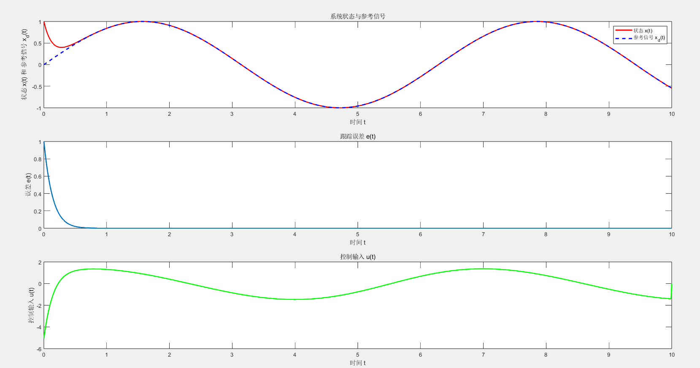

## 定义非线性系统的状态方程

### 1. 系统模型

考虑一个简单的单输入单输出 ($SISO$)一阶非线性系统，状态方程如下：

​						$$\dot{x}(t)=-ax(t)+bu(t)+cx(t)^2$$

其中： $x(t)$是系统状态，$u(t)$是控制输入，$a$、$b$ 和 $c$是系统的常数参数，假设$a>0,b>0,c>0.$​

### 2. 误差定义与性能函数

定义系统状态$x(t)$ 与参考信号 $x_d(t)$ 之间的误差为：

​						$$ e(t) = x(t)-x_d(t)$$

目标是设计一个控制输入 $u(t)$ ，使得误差 $e(t)$​​ 收敛到零，并满足给定的性能函数。

引入一个性能函数 $\rho(t)$ ，定义误差的收敛速度和范围：

​							$$\rho(t)=(\rho_0-\rho_\infty)\exp(-\lambda t)+\rho_\infty $$​

其中，$\rho_0$ 是初始误差容限，$ρ_{\infty}$ 是最终误差容限，$λ > 0$​ 是收敛速度。

要求误差 $e(t)$ 满足不等式：    $|e(t)| < \rho(t)$​


### 误差转换

在$PPC$中，为了满足性能要求，通常会对误差进行非线性转换。这是为了将实际的误差 $e(t)=x(t)−x_d(t)$ 转换为一个新的误差变量 $ξ(t)$，使得这个新的误差变

量在一个标准的、容易处理的区间内变化。为了确保误差 $e(t)$ 满足性能函数的要求，我们引入一个标准化的误差变量$\xi(t)$，定义如下误差转换函数：

​								$$\xi(t) = \frac{e(t)}{\rho(t)}$$

这个转换的目的是将原始误差 $e(t)$ 映射到一个标准化的区间内，使其与性能函数 $ρ(t)$ 相关联。转换后的误差 $\xi(t)$​具有如下的标准化性质：

​								$$|\xi(t)| < 1$$

这样，我们可以在 $\xi(t)$​的空间中设计控制律，确保系统的动态行为满足预设的性能。


### 动态误差方程

将状态方程代入误差定义中，可以得到误差的动态方程：

​						$$ \dot e(t) = \dot x(t) - \dot x_d(t)$$

将系统的状态方程代入，可得到：

​						$$\dot e(t) = -ax(t) + bu(t) + cx^2(t)-\dot x_d(t)$$

通过**误差转换**，可以将误差的动态方程表达为 $\xi(t)$ 的动态方程。首先计算 $\xi(t)$​ 的导数：

​						$$\dot\xi(t) = \frac{\dot e(t)\rho(t)-e(t)\dot \rho(t)}{\rho^2(t)}$$​

然后将 $\dot e(t)$ 替换为系统的动态方程与参考信号导数之差：

​				$$\dot{e}(t)=-ax(t)+bu(t)+cx^2(t)-\dot{x}_d(t)$$​

代入上式可得：

​				$$\dot{\xi}(t)=\frac{-ax(t)+bu(t)+cx^2(t)-\dot{x}_d(t)}{\rho(t)}-\frac{e(t)\dot{\rho}(t)}{\rho^2(t)}$$​

### 期望误差动态

为了确保误差收敛到零，我们希望$\xi(t)$满足以下期望动态方程：

​					$$\dot\xi(t)=-k\xi(t)$$

其中$k>0$​​​是控制增益，决定了误差的收敛速度。

### 控制律推导

将实际的$\xi(t)$的动态方程与期望的动态方程匹配，可以得到：

​			$$\frac{-ax(t)+bu(t)+cx^2(t)-\dot{x}_d(t)}{\rho(t)}-\frac{e(t)\dot{\rho}(t)}{\rho^2(t)}=-k\frac{e(t)}{\rho(t)}$$

进一步简化，可以得到控制输入$u(t)$ 的表达式：

​			$$bu(t)=-ke(t)+ax(t)-cx^2(t)+\dot{x}_d(t)+\frac{e(t)\dot{\rho}(t)}{\rho(t)}$$

因此，最终的控制律为：

​			$$u(t)=\dfrac{1}{b}\left(-ke(t)+ax(t)-cx^2(t)+\dot{x}_d(t)+\dfrac{e(t)\dot{\rho}(t)}{\rho(t)}\right)$$

### 

具体来说，$\xi(t)$是通过以下步骤计算的：

在实际应用中，$\xi(t)$的计算过程实际上是通过计算误差$e(t)=x(t)-x_d(t)$并除以性能函数$\rho(t)$来完成的。

然后，将$\xi(t)$的期望动态方程和系统的实际误差动态方程进行四配，从而得到控制律。

​	1.测量当前状态$x(t)$,计算误差$e(t)=x(t)-x_d(t)$​。

​	2.计算性能函数$\rho(t)$,该函数通常是时间的函数，决定了误差的允许范围。

​	3.计算标准化误差$\xi(t)$,通过将实际误差$e(t)$除以性能函数$\rho(t)$得到

​			$$\xi(t)=\frac{e(t)}{\rho(t)}$$

​	4.将$\xi(t)$应用于期望的动态方程$\dot{\xi}(t)=-k\xi(t)$,然后将这个动态方程与实际系统的动态方程匹配，以设计控制律$u(t)$​​​。


### 仿真结果

```matlab
% 初始化参数
a = 1; % 系统参数 a
b = 1; % 系统参数 b
c = 0.1; % 系统参数 c
k = 5; % 控制增益 k
rho_0 = 0.5; % 初始性能函数值
rho_inf = 0.01; % 性能函数的下限
lambda = 1; % 性能函数的衰减速率

% 仿真时间
T = 10; % 仿真总时间
dt = 0.01; % 仿真时间步长
t = 0:dt:T; % 时间向量

% 初始条件
x0 = 1; % 初始状态 x(0)
x_d0 = 0; % 参考信号初始值
x = zeros(1, length(t)); % 状态 x 的存储向量
x_d = sin(t); % 参考信号，设为正弦信号
x(1) = x0;

% 控制输入 u 的存储向量
u = zeros(1, length(t));

% 性能函数 rho(t) 的存储向量
rho = (rho_0 - rho_inf) * exp(-lambda * t) + rho_inf;

% 仿真过程
for i = 1:length(t)-1
    % 计算误差
    e = x(i) - x_d(i);
    
    % 计算标准化误差
    xi = e / rho(i);
    
    % 计算控制输入 u
    u(i) = (1/b) * (-k * e + a * x(i) - c * x(i)^2 + diff(x_d(i:i+1))/dt + (e * diff(rho(i:i+1))/dt) / rho(i)^2);
    
    % 状态更新（使用欧拉法）
    x(i+1) = x(i) + dt * (-a * x(i) + b * u(i) + c * x(i)^2);
end

% 绘图
figure;
subplot(3,1,1);
plot(t, x, 'b', t, x_d, 'r--');
xlabel('时间 t');
ylabel('状态 x(t) 和 参考信号 x_d(t)');
legend('状态 x(t)', '参考信号 x_d(t)');
title('系统状态与参考信号');

subplot(3,1,2);
plot(t, x - x_d);
xlabel('时间 t');
ylabel('误差 e(t)');
title('跟踪误差 e(t)');

subplot(3,1,3);
plot(t, u);
xlabel('时间 t');
ylabel('控制输入 u(t)');
title('控制输入 u(t)');

```




